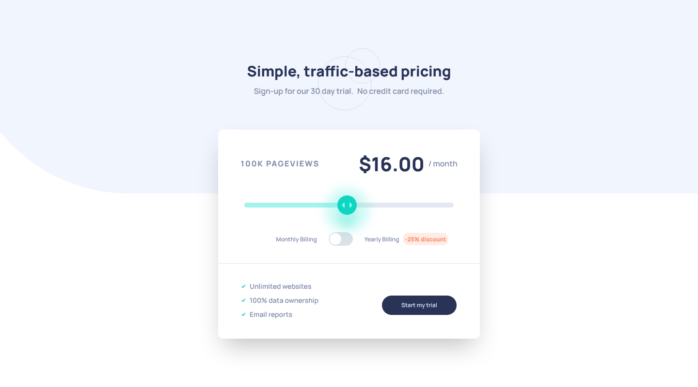

# Frontend Mentor - Interactive pricing component solution

This is a solution to the [Interactive pricing component challenge on Frontend Mentor](https://www.frontendmentor.io/challenges/interactive-pricing-component-t0m8PIyY8). Frontend Mentor challenges help you improve your coding skills by building realistic projects. 

## Overview

### The challenge

Users should be able to:

- View the optimal layout for the app depending on their device's screen size
- See hover states for all interactive elements on the page
- Use the slider and toggle to see prices for different page view numbers

### Screenshot

### Links

- Live Site URL: 

## My process

### Built with

- Semantic HTML5 markup
- CSS custom properties
- Flexbox
- CSS Grid
- Mobile-first workflow
- [React](https://reactjs.org/) - JS library
- [Next.js](https://nextjs.org/) - React framework
- [Chakra](https://chakra-ui.com/) - For styles and components

### What I learned

This is my first project with Chakra and I love all the things you can do with it. It totally changes the way that you can style components, making the code a lot cleaner.

## Author

- LinkedIn - [Emi Acerbi](https://www.linkedin.com/in/emiliano-acerbi-7a7141235/)

## Acknowledgments

As usual, thanks to [Frontend Mentor](https://www.frontendmentor.io/home) for always bringing awesome challenges to practice and get better with.  
